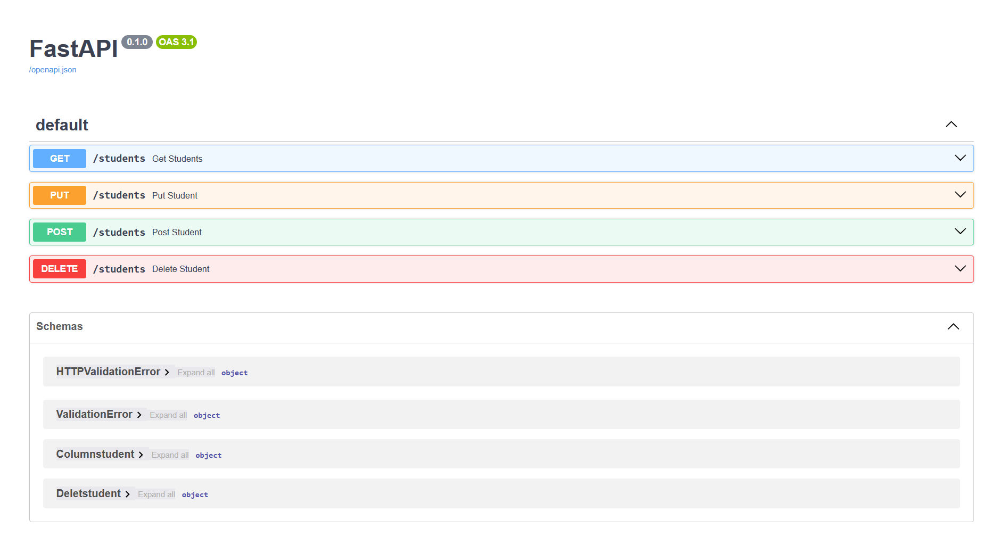

# Students API

A simple FastAPI project for managing students.



## API overview
This API provides basic CRUD operations for student records using FastAPI and MySQL.

### Available endpoints
- GET /students: Retrieve all students
- POST /students: Create a new student
- PUT /students: Update an existing student
- DELETE /students: Delete a student by ID
- GET /: Redirects to the API documentation

## Request details

### GET /students
Retrieves all students from the database.

Request:
- No body required

Response example:
```json
[
  {
    "id": 1,
    "name": "Abdalrhman",
    "age": 20,
    "grade": 9.57
  }
]
```

### POST /students
Creates a new student record.

Request body:
```json
{
  "id": 2,
  "name": "Adel",
  "age": 20,
  "grade": 9.55
}
```

Response example:
```json
{
  "message": "Student Created"
}
```

### PUT /students
Updates an existing student record using the provided ID.

Request body:
```json
{
  "id": 3,
  "name": "Karim",
  "age": 21,
  "grade": 9.53
}
```

Response example:
```json
{
  "message": "Student Updated"
}
```

### DELETE /students
Deletes a student from the database using the student ID.

Request body:
```json
{
  "id": 1
}
```

Response example:
```json
{
  "message": "Student Deleted"
}
```

## Run locally
1. Install localy: `git clone "https://github.com/Abdalrahman7401/studens-api-pyfastapi"`
2. Install dependencies: `pip install -r requirements.txt`
3. Start the server: `uvicorn main:app --reload`
4. Open the documentation at: `http://127.0.0.1:8000/docs`


